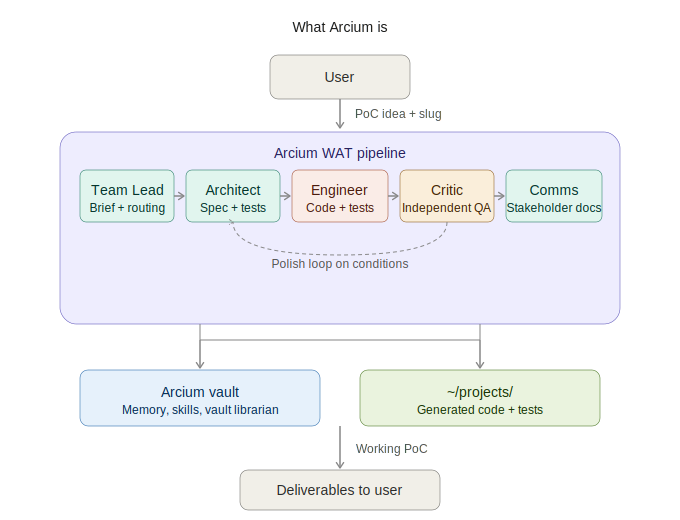
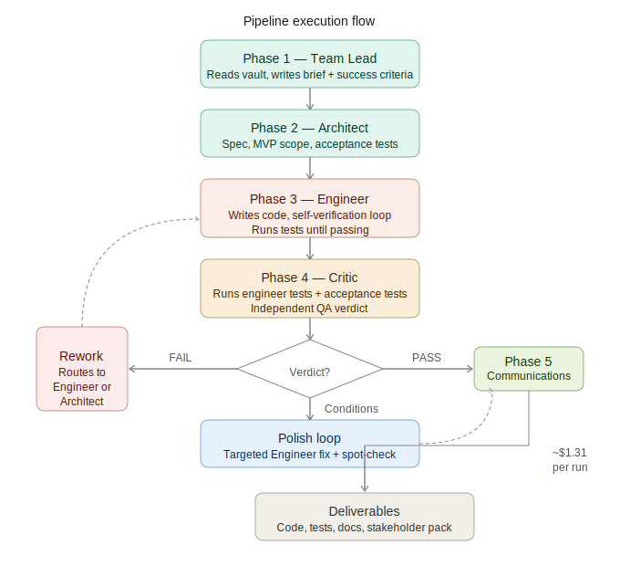
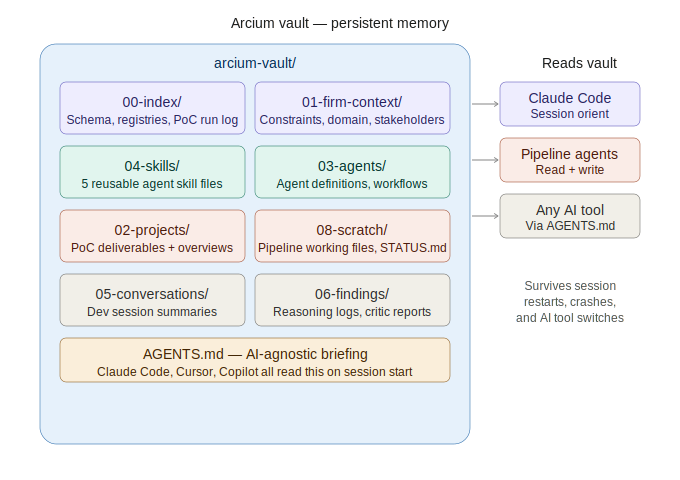

# Arcium

Reusable agentic AI infrastructure library for building AI-powered proof-of-concept systems.

Arcium provides:
- **MCP (Model Context Protocol) servers** for connecting Claude Code to vault and project filesystems
- **ReAct agents** with firm-aware context and cost controls
- **WAT Pipeline** (Workflows + Agents + Tools) for orchestrating multi-agent PoC development
- **Obsidian vault** as persistent memory shared between humans and agents across sessions

---

## Architecture

### System overview



### Pipeline execution flow



### Vault structure



---

## AI Agent Briefing Files

Arcium uses `AGENTS.md` as the canonical AI briefing file. It is recognized by multiple AI coding assistants:

| File | Tool |
|---|---|
| `AGENTS.md` | Canonical source — Claude Code, Amp, and most tools |
| `CLAUDE.md` | Redirects to `AGENTS.md` — Claude Code fallback |
| `.cursorrules` | Cursor IDE |
| `.github/copilot-instructions.md` | GitHub Copilot |

All four files are generated by `scripts/setup_vault.py` from the same source. Run setup to regenerate them after changing the vault path.

---

## Getting Started

### Prerequisites

- Python 3.10 or higher
- [Poetry](https://python-poetry.org/docs/#installation)
- Claude Code CLI (`npm install -g @anthropic-ai/claude-code`)

### 1. Clone and install

```bash
git clone <repo-url>
cd arcium
poetry install
```

### 2. Set up the vault

The vault is an Obsidian-compatible markdown directory that serves as persistent memory for agents.

```bash
# Create vault at the default location (~/Documents/arcium-vault)
python scripts/setup_vault.py

# Or specify a custom path
python scripts/setup_vault.py --vault-path ~/Documents/my-vault
```

This creates the full 9-folder vault structure, copies template files, and generates `AGENTS.md`,
`CLAUDE.md`, `.cursorrules`, and `.github/copilot-instructions.md`.

### 3. Configure paths

```bash
cp config.json.example config.json
```

Edit `config.json` and set your vault path:
```json
{
  "vault_path": "~/Documents/arcium-vault"
}
```

### 4. Configure MCP

```bash
cp .mcp.json.example .mcp.json
```

The default `.mcp.json.example` uses `poetry` on your PATH. Edit `.mcp.json` if your Poetry install is in a non-standard location.

### 5. Register with Claude Code

```bash
# Option A: MCP config file (recommended — persists across sessions)
# Edit .mcp.json as above, then restart Claude Code

# Option B: claude mcp add command
claude mcp add arcium --command poetry -- run python -m arcium.mcp.server
```

### 6. Populate firm context

Edit the following vault files with your organization's context:

- `~/Documents/arcium-vault/01-firm-context/CONSTRAINTS.md` — data privacy, compliance, restrictions
- `~/Documents/arcium-vault/01-firm-context/DOMAIN.md` — industry, tech stack, pain points
- `~/Documents/arcium-vault/01-firm-context/STAKEHOLDERS.md` — decision authority and audience profiles

---

## Running Examples

```bash
# Run the full WAT pipeline end-to-end (interactive prompts if no args)
poetry run python examples/run_pipeline.py

# Or invoke directly with arguments
poetry run python -m arcium.workflow.poc_pipeline \
    --idea "Build a word frequency CLI tool" \
    --slug "word-frequency"

# Feedback iteration on an existing PoC (skips Discovery + Architecture)
poetry run python -m arcium.workflow.poc_pipeline \
    --slug "word-frequency" \
    --feedback "Add CSV export and support stdin"

# Smoke test all MCP tools
poetry run python examples/smoke_test_mcp.py

# Smoke test the ReactAgent (requires ANTHROPIC_API_KEY in .env)
poetry run python examples/smoke_test_agent.py
```

---

## Modules

### `arcium.mcp.server`

Unified MCP server with 12 tools across two namespaces:

**Vault tools** (`vault__*`) — operations on the Obsidian vault:
- `vault__read_file` — read any file
- `vault__write_file` — create or overwrite markdown files (rejects code files)
- `vault__append_file` — append to existing files
- `vault__list_files` — list files with glob pattern support
- `vault__search_content` — search file contents (regex)

**Projects tools** (`projects__*`) — Python project code generation:
- `projects__create_structure` — scaffold a GitHub-ready Poetry project
- `projects__write_file` — write any file type into `~/projects/<slug>/`
- `projects__read_file` — read a project file
- `projects__list_files` — list project files
- `projects__check_syntax` — Python syntax validation
- `projects__check_dependencies` — `poetry check` validation
- `projects__run_tests` — `poetry run pytest` execution

### `arcium.agent`

**`ReactAgent`** — ReAct (Reasoning + Acting) agent using Claude as reasoning engine:
- Firm-aware context loading from vault
- Token tracking and cost estimation
- Exponential backoff for rate limits
- DEV_MODE for cost-effective testing

**`ClaudeCodeAgent`** — autonomous agent via Claude Code CLI in headless mode:
- Bypasses Anthropic API rate limits
- Native file editing via Claude Code's built-in tools
- Single subprocess call — Claude Code handles the full conversation internally
- Used by Engineer and Critic roles in the WAT pipeline

### `arcium.workflow`

**`PoCPipeline`** — WAT pipeline orchestrating five specialist agents:

1. **Team Lead** — requirements, project brief, iteration decisions
2. **Senior Architect** — technical design, architecture spec, MVP scoping
3. **Senior Engineer** — implementation, self-verification loop
4. **Solutions Critic** — independent quality gate, structured YAML verdict
5. **Communications Specialist** — stakeholder deliverables (exec summary, deck, position paper)

```python
from arcium import run_poc_pipeline

result = run_poc_pipeline(
    poc_idea="Build a CLI tool that counts word frequency in text files",
    poc_slug="word-frequency"
)

print(f"Status: {result['status']}")
print(f"Code: {result['project_dir']}")
print(f"Docs: {result['scratch_dir']}")
```

### `arcium.config`

Centralized environment variable loading with sensible defaults:

| Variable | Default | Description |
|---|---|---|
| `ARCIUM_VAULT_PATH` | `~/Documents/arcium-vault` | Path to vault |
| `ARCIUM_PROJECTS_PATH` | `~/projects` | Path for generated PoC projects |
| `ARCIUM_MCP_CONFIG` | `./.mcp.json` | Path to MCP config |
| `ARCIUM_REASONING_LOG_DIR` | `<vault>/06-findings` | Agent reasoning logs |
| `ANTHROPIC_API_KEY` | — | Required for ReactAgent only |
| `DEV_MODE` | `false` | `true` = Haiku model, lower cost limits |

---

## WAT Pipeline Details

### Skill Files

The pipeline loads specialist roles from vault skill files in `04-skills/`:

| File | Role |
|---|---|
| `team-lead.md` | Requirements, orchestration, iteration decisions |
| `senior-architect.md` | System design, MVP scoping |
| `senior-engineer.md` | Implementation, self-verification |
| `solutions-critic.md` | Quality gate, structured YAML verdict |
| `communications-specialist.md` | Stakeholder deliverables |

Edit these files in your vault to customize agent behavior. Changes take effect on the next pipeline run.

### Scratch Folder Handoff Pattern

Agents collaborate through markdown files in `08-scratch/poc-pipeline-<slug>/`:

```
08-scratch/poc-pipeline-word-frequency/
├── 00-brief.md              # Team Lead's project brief
├── 01-architect-spec.md     # Architect's technical design
├── 02-engineer-output.md    # Engineer's implementation notes
├── 03-critic-report.md      # Critic's quality assessment (with YAML verdict)
└── 04-stakeholder-summary.md # Communications deliverable
```

Real code output goes to `~/projects/<slug>/` — outside the vault.

### Critic Verdict Format

The Critic writes a YAML frontmatter block that the pipeline parses for routing decisions:

```yaml
---
verdict: PASS | PASS_WITH_CONDITIONS | FAIL
root-cause: design_flaw | implementation_bug | infeasible | null
critical-count: 0
high-count: 0
requires-human-decision: false
---
```

- `PASS` → proceeds to Communications
- `PASS_WITH_CONDITIONS` with HIGH issues → auto-iterates (minor) or escalates to human (substantial)
- `PASS_WITH_CONDITIONS` with only MEDIUM/LOW → triggers **polish loop** (see below)
- `FAIL` → routes to Architect (`design_flaw`) or Engineer (`implementation_bug`), or escalates (`infeasible`)

### Polish Loop

When the Critic issues `PASS_WITH_CONDITIONS` with only medium and low severity issues, the pipeline runs one targeted polish pass outside the main iteration counter:

1. Engineer receives a scoped work order listing only the flagged items (not the full report)
2. Critic runs a lightweight spot-check verifying only those specific items
3. Pipeline proceeds to Communications regardless of spot-check result (FAIL falls back gracefully)

STATUS.md shows `Critic passed with conditions — Engineer polishing before handoff` during this phase.
The spot-check report is written to `03-critic-spotcheck.md` alongside the original `03-critic-report.md`.

### Feedback Iteration

Resume an existing PoC with human feedback without re-running Discovery and Architecture:

```bash
# After initial pipeline run on word-frequency
poetry run python -m arcium.workflow.poc_pipeline \
    --slug "word-frequency" \
    --feedback "Add CSV export and support stdin in addition to file path"
```

What happens:
1. Loads existing Architect spec from `08-scratch/poc-pipeline-<slug>/01-architect-spec.md`
2. Writes feedback to `08-scratch/poc-pipeline-<slug>/05-feedback-brief.md`
3. Skips Team Lead and Architect — routes directly to Engineer
4. Engineer receives existing spec + feedback as a combined work order
5. Continues through normal Review → Polish Loop → Communications flow

Requires that the full pipeline has completed through the Architecture phase for the given slug.
If the Architect spec is missing, the pipeline raises a `FileNotFoundError` with instructions.

```python
from arcium import run_feedback_pipeline

result = run_feedback_pipeline(
    feedback="Add CSV export and support stdin in addition to file path",
    poc_slug="word-frequency"
)
```

### Cost Controls

| Mode | Model | Max steps | Cost limit |
|---|---|---|---|
| DEV_MODE=true | claude-haiku-4-5 | 5 | $2.00 |
| DEV_MODE=false | claude-sonnet-4 | 10 | $10.00 |

With all agents in autonomous mode (`ClaudeCodeAgent`), costs are billed to your Claude Code subscription (Max plan), not the Anthropic API.

---

## Using Arcium as a Library

Install Arcium as a path dependency in your own PoC project:

```toml
# your-project/pyproject.toml
[tool.poetry.dependencies]
python = "^3.10"
arcium = {path = "../arcium", develop = true}
```

```python
from arcium.vault import VaultTools, Config

config = Config()
vault = VaultTools(config.vault_path)

content = vault.read_file("06-findings/my-research.md")
vault.write_file("08-scratch/output.md", "# Results\n...")
```

---

## Development

```bash
# Install dependencies
poetry install

# Run MCP server directly
poetry run python -m arcium.mcp.server

# Add dependencies
poetry add package-name
```

### Security Notes

`ClaudeCodeAgent` uses `--dangerously-skip-permissions` for pipeline automation. This is intentional — the MCP server enforces path boundaries by constraining tool access to the vault and `~/projects/<slug>/` directories. For production deployments, run inside Docker containers for additional isolation.

See `arcium-vault/06-findings/claude-code-headless-security.md` for the full security analysis.

---

## Project Structure

```
arcium/
├── AGENTS.md                   # Canonical AI briefing (all tools)
├── CLAUDE.md                   # One-line redirect to AGENTS.md
├── .cursorrules                # Cursor IDE briefing
├── .github/
│   └── copilot-instructions.md # GitHub Copilot briefing
├── pyproject.toml
├── poetry.lock
├── config.json.example         # Copy to config.json, set vault_path
├── .mcp.json.example           # Copy to .mcp.json
├── scripts/
│   └── setup_vault.py          # Generates vault + all briefing files
├── examples/
│   ├── run_pipeline.py         # End-to-end pipeline demo
│   ├── smoke_test_mcp.py       # MCP tools smoke test
│   └── smoke_test_agent.py     # ReactAgent smoke test
├── templates/
│   └── vault/                  # Sanitized vault templates
│       ├── 00-index/
│       ├── 01-firm-context/
│       ├── 03-agents/workflows/
│       └── 04-skills/
└── src/
    └── arcium/
        ├── __init__.py
        ├── config.py
        ├── agent/
        │   ├── react.py
        │   ├── backend.py
        │   └── claude_code_agent.py
        ├── mcp/
        │   └── server.py
        ├── projects/
        │   └── tools.py
        ├── vault/
        │   ├── tools.py
        │   └── config.py
        └── workflow/
            ├── poc_pipeline.py
            ├── skill_injector.py
            └── models.py
```

---

## License

MIT
