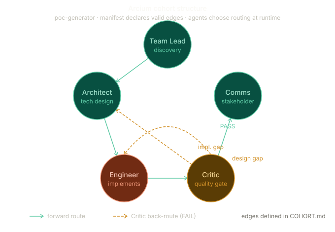

# Arcium

Arcium is an enterprise agentic coordination platform. Define agent teams as composable CAST manifests (Cohort, Agent, Skill, Tool), coordinate them autonomously through a manifest-driven graph executor, and manage persistent knowledge through a federated vault architecture.

Arcium provides:
- **CAST manifests** — declarative definitions for Cohorts, Agents, Skills, and Tools stored in the vault marketplace
- **CohortCoordinator** — manifest-driven orchestration of multi-agent teams through a graph executor with agent-routed transitions
- **MCP server** — 12 tools connecting Claude Code to vault and project filesystems
- **Obsidian vault** — persistent, federated memory shared between humans and agents across sessions

---

## AI Agent Briefing Files

Arcium uses `AGENTS.md` as the canonical AI briefing file, recognized by multiple AI coding assistants:

| File | Tool |
|---|---|
| `AGENTS.md` | Canonical source — Claude Code, Amp, and most tools |
| `CLAUDE.md` | Redirects to `AGENTS.md` — Claude Code fallback |
| `.cursorrules` | Cursor IDE |
| `.github/copilot-instructions.md` | GitHub Copilot |

All four files are generated by `scripts/setup_vault.py` from the same source.

---

## CAST Framework

CAST is the four-primitive manifest model that defines everything a CohortCoordinator can execute:

| Primitive | File | Purpose |
|---|---|---|
| **C**ohort | `COHORT.md` | Graph declaration: nodes, roles, routing rules, SLA, quality gates |
| **A**gent | `AGENT.md` | Persona: identity, behavior, escalation rules, blast radius |
| **S**kill | `SKILL.md` | Injectable capability appended to an agent's system prompt |
| **T**ool | `TOOL.md` | MCP tool manifest: endpoints, allowed/denied operations, audit config |

All CAST artifacts live in `02-marketplace/` in the vault and are indexed in `02-marketplace/_registry/index.json`.

### Composition model

For each agent role in a cohort run, the CohortCoordinator composes a system prompt in this order:

1. **Persona block** — AGENT.md body (identity, responsibilities, escalation rules)
2. **Skills block** — any SKILL.md bodies listed in `skills_add` (alphabetical)
3. **Cohort context block** — runtime context injected at execution time (slug, iteration, coordination protocol)

Tool access is declared per-role in the COHORT.md and enforced via `--allowedTools` when launching each agent.

### Agent-driven routing

After each review phase, the Critic writes a `route_to` field in its YAML verdict frontmatter. The `GraphExecutor` reads this, validates it against the `valid_routes` declared in the COHORT.md graph node, and routes accordingly. Routing decisions are tagged `[agent-routed]` in `COHORT-DECISIONS.md`.



---

## Getting Started

### Prerequisites

- Python 3.10 or higher
- [Poetry](https://python-poetry.org/docs/#installation)
- Claude Code CLI (`npm install -g @anthropic-ai/claude-code`)

### 1. Clone and install

```bash
git clone <repo-url>
cd arcium
poetry install
```

### 2. Set up the vault

The vault is an Obsidian-compatible markdown directory that serves as persistent memory for agents.

Create vault at the default location (`~/Documents/arcium-vault`):

```bash
python scripts/setup_vault.py
```

Or specify a custom path:

```bash
python scripts/setup_vault.py --vault-path ~/Documents/my-vault
```

This creates the full vault structure, copies template files, and generates `AGENTS.md`, `CLAUDE.md`, `.cursorrules`, and `.github/copilot-instructions.md`.

### 3. Configure paths

Copy the example config and edit it to set your vault path:

```bash
cp arcium.config.example.yaml arcium.config.yaml
```

Edit `arcium.config.yaml`:

```yaml
vault:
  path: ~/Documents/arcium-vault

execution:
  provider: claude_code
  model: default
```

`arcium.config.yaml` is gitignored — never commit it.

### 4. Configure MCP

```bash
cp .mcp.json.example .mcp.json
```

Run `which poetry` to find your Poetry binary path, then edit `.mcp.json` and replace `/path/to/your/poetry` with the result.

### 5. Register with Claude Code

**Option A** (recommended — persists across sessions): Edit `.mcp.json` as above, then restart Claude Code.

**Option B** (one-off command):

```bash
claude mcp add arcium --command poetry -- run python -m arcium.mcp.server
```

### 6. Populate firm context

Edit the following vault files with your organization's context:

- `~/Documents/arcium-vault/01-firm-context/CONSTRAINTS.md` — data privacy, compliance, restrictions
- `~/Documents/arcium-vault/01-firm-context/DOMAIN.md` — industry, tech stack, pain points
- `~/Documents/arcium-vault/01-firm-context/STAKEHOLDERS.md` — decision authority and audience profiles

---

## Vault Structure

Arcium requires a vault directory at `~/Documents/arcium-vault` (or the path set in `arcium.config.yaml`).

```
arcium-vault/
├── 00-index/               # Schema, indexes, conversation log, cohort run log
│   └── workflows/          # Operator runbooks (e.g. session-close.md)
├── 01-firm-context/        # Constraints, domain, stakeholders — edit these
├── 02-marketplace/         # CAST artifacts — agents, skills, tools, cohorts
│   ├── agents/
│   ├── skills/
│   ├── tools/
│   ├── cohorts/
│   └── _registry/          # index.json — rebuilt on every vault commit
├── 03-cohort-work/         # Deliverables: one subfolder per completed cohort run
├── 04-findings/            # Research notes, reasoning logs
├── 05-sessions/            # Session summaries (auto-logged at session close)
├── 06-scratch/             # Cohort scratch work: 06-scratch/cohort-<slug>/
├── 07-sync-outbox/         # Staged artifacts pending push to parent vault
└── 99-archive/             # Completed projects and deprecated content
```

Clone an existing vault or generate a fresh one from templates:

```bash
python scripts/setup_vault.py
```

### Vault identity

Each vault has a `.vault-config.yaml` at its root (gitignored). Copy from the example:

```bash
cp .vault-config.yaml.example .vault-config.yaml
```

Edit to set your `vault_id` and (when federated) `parent` vault reference.

---

## Running a Coordination

```bash
# Run a full coordination end-to-end
poetry run python -m arcium.workflow.cohort_coordinator \
    --idea "Build a word frequency CLI tool" \
    --slug "word-frequency" \
    --cohort poc-generator

# Feedback iteration on an existing run (skips Discovery + Architecture)
poetry run python -m arcium.workflow.cohort_coordinator \
    --slug "word-frequency" \
    --feedback "Add CSV export and support stdin" \
    --cohort poc-generator

# Smoke test all MCP tools
poetry run python examples/smoke_test_mcp.py

# Rebuild the marketplace registry
poetry run python -m arcium.registry.builder

# Run vault sync (no-op until parent vault is configured)
poetry run python -m arcium.sync.agent --dry-run
```

---

## Modules

### `arcium.mcp.server`

Unified MCP server with 12 tools across two namespaces:

**Vault tools** (`vault__*`) — operations on the Obsidian vault:
- `vault__read_file` — read any file
- `vault__write_file` — create or overwrite markdown files (rejects code files)
- `vault__append_file` — append to existing files
- `vault__list_files` — list files with glob pattern support
- `vault__search_content` — search file contents (regex)

**Projects tools** (`projects__*`) — Python project code generation:
- `projects__create_structure` — scaffold a GitHub-ready Poetry project
- `projects__write_file` — write any file type into `~/projects/<slug>/`
- `projects__read_file` — read a project file
- `projects__list_files` — list project files
- `projects__check_syntax` — Python syntax validation
- `projects__check_dependencies` — `poetry check` validation
- `projects__run_tests` — `poetry run pytest` execution

### `arcium.agent`

**`ReactAgent`** — ReAct (Reasoning + Acting) agent using Claude as reasoning engine:
- Firm-aware context loading from vault
- Token tracking and cost estimation
- Exponential backoff for rate limits
- DEV_MODE for cost-effective testing

**`ClaudeCodeAgent`** — autonomous agent via Claude Code CLI in headless mode:
- Bypasses Anthropic API rate limits
- Native file editing via Claude Code's built-in tools
- Single subprocess call — Claude Code handles the full conversation internally
- Tool access enforced via `--allowedTools` resolved from TOOL.md manifests

### `arcium.workflow`

**`CohortCoordinator`** — manifest-driven orchestration engine:

Loads a COHORT.md manifest, composes system prompts for each agent role via `CohortManifestResolver`, and drives execution through a `GraphExecutor` that routes between nodes based on agent verdicts.

Default `poc-generator` cohort runs five specialist agents:

1. **Team Lead** — requirements, project brief, iteration decisions
2. **Senior Architect** — technical design, architecture spec, MVP scoping
3. **Senior Engineer** — implementation, self-verification loop
4. **Solutions Critic** — independent quality gate, structured YAML verdict with `route_to`
5. **Communications Specialist** — stakeholder deliverables (exec summary, deck, position paper)

```python
from arcium.workflow.cohort_coordinator import CohortCoordinator

coordinator = CohortCoordinator(cohort_id="poc-generator")
result = coordinator.run(
    poc_idea="Build a CLI tool that counts word frequency in text files",
    poc_slug="word-frequency"
)

print(f"Status: {result['status']}")
print(f"Cost: ${result['total_cost']:.2f}")
print(f"Deliverables: {result['deliverables']}")
```

**`CohortManifestResolver`** — loads COHORT.md from `02-marketplace/cohorts/`, resolves AGENT.md and SKILL.md bodies, and composes fully-formed system prompts for each role.

**`GraphExecutor`** — reads `route_to` / `route_reason` from the Critic's YAML verdict frontmatter, validates against `valid_routes` in the manifest graph node, and falls back to `default_next` when no agent routing is present.

**`ToolManifestResolver`** — resolves bundle names (e.g. `vault_only`, `all`) to `--allowedTools` CLI arguments by reading TOOL.md manifests from `02-marketplace/tools/`.

### `arcium.registry`

**`builder`** — scans `02-marketplace/` and writes `02-marketplace/_registry/index.json`, a flat lookup table keyed by `<id>@<version>`:

```bash
poetry run python -m arcium.registry.builder
```

The vault's `.git/hooks/post-commit` hook runs this automatically on every vault commit.

### `arcium.sync`

**`VaultSyncAgent`** — lightweight sync service for federated vault management:
- **Pull**: syncs `01-firm-context/` and `02-marketplace/` from a parent vault (SHA256-based, only copies changed files)
- **Push**: stubs `07-sync-outbox/` → PR to parent vault (Phase 5)
- No-op when `parent: null` in `.vault-config.yaml`

```bash
poetry run python -m arcium.sync.agent --dry-run
```

### `arcium.config`

Centralized environment variable loading with sensible defaults:

| Variable | Default | Description |
|---|---|---|
| `ARCIUM_VAULT_PATH` | `~/Documents/arcium-vault` | Path to vault |
| `ARCIUM_PROJECTS_PATH` | `~/projects` | Path for generated projects |
| `ARCIUM_MCP_CONFIG` | `./.mcp.json` | Path to MCP config |
| `ARCIUM_REASONING_LOG_DIR` | `<vault>/04-findings` | Agent reasoning logs |
| `ANTHROPIC_API_KEY` | — | Required for ReactAgent only |
| `DEV_MODE` | `false` | `true` = Haiku model, lower cost limits |

---

## Coordination Details

### Agent manifest files

Agent personas are loaded from `02-marketplace/agents/`:

| File | Role |
|---|---|
| `team-lead.md` | Requirements, orchestration, iteration decisions |
| `senior-architect.md` | System design, MVP scoping |
| `senior-engineer.md` | Implementation, self-verification |
| `solutions-critic.md` | Quality gate, structured YAML verdict |
| `communications-specialist.md` | Stakeholder deliverables |

Edit these files in your vault to customize agent behavior. Changes take effect on the next coordination run.

### Scratch folder handoff pattern

Agents collaborate through markdown files in `06-scratch/cohort-<slug>/`:

```
06-scratch/cohort-word-frequency/
├── 00-brief.md              # Team Lead's project brief
├── 01-architect-spec.md     # Architect's technical design
├── 02-engineer-output.md    # Engineer's implementation notes
├── 03-critic-report.md      # Critic's quality assessment (with YAML verdict)
└── 03-critic-spotcheck.md   # Critic's spot-check (after polish loop)
```

Real code output goes to `~/projects/<slug>/` — outside the vault.
Final deliverables go to `03-cohort-work/<slug>/`.

### Audit log

Every coordination run appends a structured entry to `00-index/COHORT-DECISIONS.md` recording agent verdicts, routing outcomes (`[agent-routed]` or `[default]`), and cost per phase. Run history is tracked in `00-index/COHORT-RUNS.md`.

### Critic verdict format

The Critic writes a YAML frontmatter block that the `GraphExecutor` parses for routing decisions:

```yaml
---
verdict: PASS | PASS_WITH_CONDITIONS | FAIL
root-cause: design_flaw | implementation_bug | infeasible | null
critical-count: 0
high-count: 0
requires-human-decision: false
route_to: communications-specialist | senior-engineer | senior-architect
route_reason: one sentence explanation
---
```

- `PASS` → proceeds to Communications
- `PASS_WITH_CONDITIONS` with HIGH issues → auto-iterates (minor) or escalates to human (substantial)
- `PASS_WITH_CONDITIONS` with only MEDIUM/LOW → triggers **polish loop** (see below)
- `FAIL` → routes to Architect (`design_flaw`) or Engineer (`implementation_bug`), or escalates (`infeasible`)

### Polish loop

When the Critic issues `PASS_WITH_CONDITIONS` with only medium and low severity issues, the pipeline runs one targeted polish pass outside the main iteration counter:

1. Engineer receives a scoped work order listing only the flagged items (not the full report)
2. Critic runs a lightweight spot-check verifying only those specific items
3. Pipeline proceeds to Communications regardless of spot-check result (FAIL falls back gracefully)

STATUS.md shows `Critic passed with conditions — Engineer polishing before handoff` during this phase.
The spot-check report is written to `03-critic-spotcheck.md` alongside the original `03-critic-report.md`.

### Feedback iteration

Resume an existing PoC with human feedback without re-running Discovery and Architecture:

```bash
poetry run python -m arcium.workflow.cohort_coordinator \
    --slug "word-frequency" \
    --feedback "Add CSV export and support stdin in addition to file path" \
    --cohort poc-generator
```

What happens:
1. Loads existing Architect spec from `06-scratch/cohort-<slug>/01-architect-spec.md`
2. Writes feedback to `06-scratch/cohort-<slug>/05-feedback-brief.md`
3. Skips Team Lead and Architect — routes directly to Engineer
4. Engineer receives existing spec + feedback as a combined work order
5. Continues through normal Review → Polish Loop → Communications flow

Requires that the full pipeline has completed through the Architecture phase for the given slug.

```python
from arcium.workflow.cohort_coordinator import run_feedback_pipeline

result = run_feedback_pipeline(
    feedback="Add CSV export and support stdin in addition to file path",
    poc_slug="word-frequency"
)
```

### Cost controls

| Mode | Model | Max steps | Cost limit |
|---|---|---|---|
| DEV_MODE=true | claude-haiku-4-5 | 5 | $2.00 |
| DEV_MODE=false | claude-sonnet-4 | 10 | $10.00 |

With all agents in autonomous mode (`ClaudeCodeAgent`), costs are billed to your Claude Code subscription (Max plan), not the Anthropic API.

---

## Using Arcium as a Library

Install Arcium as a path dependency in your own project:

```toml
# your-project/pyproject.toml
[tool.poetry.dependencies]
python = "^3.10"
arcium = {path = "../arcium", develop = true}
```

```python
from arcium.vault import VaultTools, Config

config = Config()
vault = VaultTools(config.vault_path)

content = vault.read_file("04-findings/my-research.md")
vault.write_file("06-scratch/output.md", "# Results\n...")
```

---

## Development

```bash
# Install dependencies
poetry install

# Run MCP server directly
poetry run python -m arcium.mcp.server

# Add dependencies
poetry add package-name
```

### Security notes

`ClaudeCodeAgent` uses `--dangerously-skip-permissions` for pipeline automation. This is intentional — the MCP server enforces path boundaries by constraining tool access to the vault and `~/projects/<slug>/` directories. For production deployments, run inside Docker containers for additional isolation.

See `arcium-vault/04-findings/claude-code-headless-security.md` for the full security analysis.

---

## Project Structure

```
arcium/
├── AGENTS.md                       # Canonical AI briefing (all tools)
├── CLAUDE.md                       # One-line redirect to AGENTS.md
├── .cursorrules                    # Cursor IDE briefing
├── .github/
│   └── copilot-instructions.md    # GitHub Copilot briefing
├── pyproject.toml
├── arcium.config.example.yaml      # Copy to arcium.config.yaml, set vault.path
├── .mcp.json.example               # Copy to .mcp.json, set poetry path
├── scripts/
│   └── setup_vault.py              # Generates vault + all briefing files
├── examples/
│   ├── run_pipeline.py             # End-to-end coordination demo
│   ├── smoke_test_mcp.py           # MCP tools smoke test
│   └── smoke_test_agent.py         # ReactAgent smoke test
├── templates/
│   └── vault/                      # Vault template (new-user onboarding)
│       ├── 00-index/               # Schema, indexes, session-close workflow
│       ├── 01-firm-context/        # Constraint, domain, stakeholder placeholders
│       ├── 02-marketplace/         # Empty — populated from firm vault
│       ├── 03-cohort-work/
│       ├── 04-findings/
│       ├── 05-sessions/
│       ├── 06-scratch/
│       ├── 07-sync-outbox/
│       ├── 99-archive/
│       ├── .vault-config.yaml.example
│       └── .gitignore
└── src/
    └── arcium/
        ├── config.py
        ├── agent/
        │   ├── react.py
        │   ├── backend.py
        │   └── claude_code_agent.py
        ├── mcp/
        │   └── server.py
        ├── projects/
        │   └── tools.py
        ├── registry/
        │   └── builder.py          # Marketplace registry builder
        ├── sync/
        │   └── agent.py            # VaultSyncAgent (pull/push)
        └── workflow/
            ├── cohort_coordinator.py
            ├── cohort_resolver.py
            ├── graph_executor.py
            ├── tool_resolver.py
            ├── skill_injector.py
            └── models.py
```

---

## License

MIT
